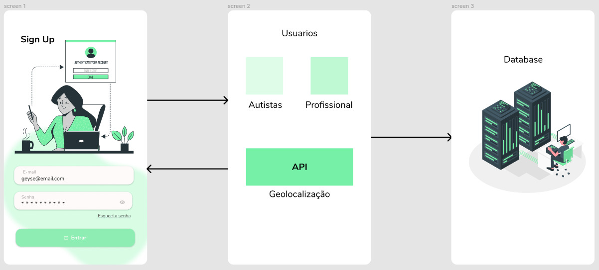
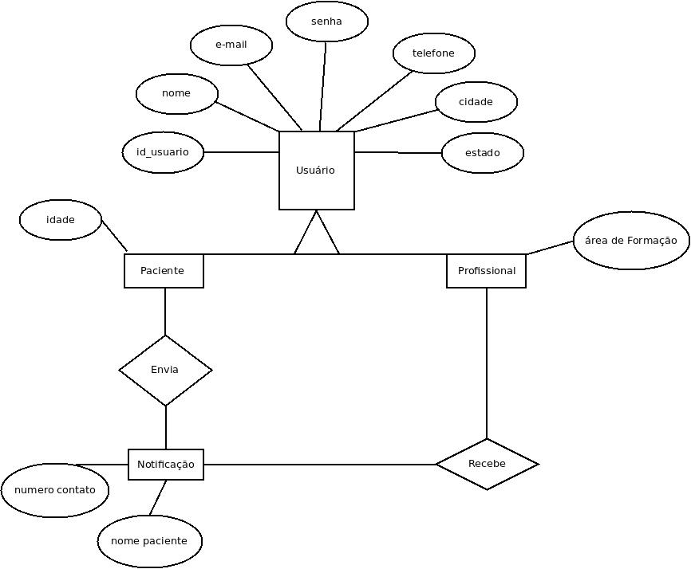

## Histórico de Versões

| Versão  |  Data  | Autor  |  Descrição  |
| ------------------- | ------------------- | ------------------- | ------------------- |
| 0.1 | 10/09/2021  | @GeiseSaunier   | Estrutura inicial  |
| 0.2 | 11/09/2021 | @GeiseSaunier e @IanoMaciel  | Implementação da representação de arquitetura |
| 0.3 | 11/09/2021  | @GeiseSaunier e @IanoMaciel | Implementação das metas e restrições da arquitetura|
| 0.4 | 11/09/2021  | @GeiseSaunier e @IanoMaciel  | Implementação da Introdução do Documento de arquitetura|
| 0.5 |   | @GeiseSaunier e @IanoMaciel | Implementação do MER|
| 0.6 |   | @GeiseSaunier e @IanoMaciel | Criação do DER|
| 0.7 |   | @GeiseSaunier e @IanoMaciel  | Adição do diagrama de casos de uso|
| 0.8 |   | @GeiseSaunier e @IanoMaciel  | Ajustes no MER|
| 0.9 |   | @GeiseSaunier e @IanoMaciel   | Ajustes no DER|
| 1.0 |   | @GeiseSaunier e @IanoMaciel  | Revisão do documento de arquitetura|
| 1.1 |   | @GeiseSaunier e @IanoMaciel   | Diagrama de representação|
| 1.2 |   | @GeiseSaunier e @IanoMaciel   | Atualização do DER |
| 1.3 |   | @GeiseSaunier e @IanoMaciel   | Inclusão de tecnologias e alteração de tripulante para passageiro |
| 1.4 |   | @GeiseSaunier e @IanoMaciel  | Atualização na descrição da nossa arquitetura MVC |
| 1.5 |   | @GeiseSaunier | Atualização do Caso de Uso |

## Sumário
1- [Introdução](#1--introdução)
* [1.1 - Finalidade](#1.1---finalidade)
* [1.2 - Escopo](#1.2---escopo)
* [1.3 - Visão Geral](#1.3---Visão-Geral)
* [1.4 - Definições,-acrônomos-e-Abreviações](#1.4---Definições,-acrônomos-e-Abreviações)

2- [Representação de Arquitetura](##-2---Representação-de-Arquitetura
)

* [2.1 - Padrão Arquitetural](###2.1---Padrão-Arquitetural)
* [2.2 - Tecnologias](#2.2---Tecnologias)

3- [Metas e Restrições da Arquitetura](#3---Metas-e-Restrições-da-Arquitetura)

* [ 3.1- Metas do Autizando](#3.1--Metas-do-Autizando)
* [3.2- Restrições da Arquitetura](#3.2--Restrições-da-Arquitetura)

4- [Visão de Dados](#4---Visão-de-Dados)
* [4.1 - MER](#4.1---MER)
  * [4.1.1 -Entidades](#4.1.1--Entidades)
  * [4.1.2 Relacionamento](4.1.2-Relacionamento)

* [4.2 DER
](#4.2-DER)

5- [Visão de Caso de Uso](#5---Visão-de-Caso-de-Uso)
* [5.1 - Diagrama de Caso de uso](#5.1---Diagrama-de-Caso-de-uso)
* [5.2- Atores de Caso de Uso](#5.2---Atores-de-Caso-de-Uso)
* [5.3- Descrições de Caso de Uso3](#5.3----Descrições-de-Caso-de-Uso)

6- [Referências Bibliográficas](#7---Referências-Bibliográficas)

## 1- Introdução

### 1.1 - Finalidade
O objetivo deste documento é apresentar a arquitetura do projeto Autizando, explicando os principais aspectos do software como um todo, bem como as decisões arquiteturais para o projeto. Além disso, contém informações que serão utilizadas por desenvolvedores e gestores para compreender a arquitetura utilizada no desenvolvimento, fluxo de informações e as tecnologias envolvidas no projeto.

### 1.2 - Escopo

O AUTIZANDO tem o propósito de tornar a consulta de pessoas portadoras do Transtorno do Espectro Autista - TEA  acessível e ágil, concentrando todas as informações necessárias para encontrar o especialista mais próximo em uma única ferramenta. 
A ferramenta trata-se de um aplicativo mobile, onde poderão ser cadastrados pessoas portadoras do TEA e profissionais especialistas em diversas áreas, como por exemplo, psiquiatra, psicólogo, etc. Para que o autista consiga localizar o profissional, ambos deverão inserir sua localidade, para que assim o autista possa ser atendido por aquele mais próximo.

### 1.3 - Visão Geral
O documento está segmento em Representação de Arquitetura, Metas e Restrições da Arquitetura, Visão de Casos de Uso, Visão Lógica e Visão de Dados.

### 1.4 - Definições, acrônomos e Abreviações

* API - Application Programming Interface: conjunto de rotinas e padrões estabelecidos por um software para a utilização das suas funcionalidades por demais aplicativos que desejam utilizar seu serviço
* Framework: Conjuntos de funções e componentes pré definidos.
* Promises: Uma Promise é um objeto que representa a eventual conclusão ou falha de uma operação assincrona.
* ORM: Mapeamento objeto-relacional é uma técnica de desenvolvimento utilizada para reduzir a impedância da programação orientada aos objetos utilizando bancos de dados relacionais

## 2 - Esquemático da Arquitetura

### 2.1 - Padrão Arquitetural	

O MVC é um padrão de arquitetura de software, onde separa sua aplicação em três camadas, sendo elas model, view e controller. Nesse projeto a camada de interação do usuário (view), é a que faz a exibição dos dados, sendo ela por meio do framework react.js e next.js; a camada de manipulação dos dados (model), responsável pela leitura e escrita dos dados no banco de dados, nesse caso postgres usando a ferramenta sequelize, e também suas validações e a camada de controle (controller), responsável por receber todas as requisições do usuário, controlando qual model usar e qual view será mostrado ao usuário. Essa divisão em camadas é realizada para facilitar a resolução de um problema maior.

* Model: Camada da arquitetura responsável pela lógica de négocio, manipulação e validação de dados na aplicação.
* View: Camada da arquitetura responsável pela exibição da interface com o usuário.
* Controller: Camada da arquitetura responsável pela validação das requisições dos usuário de acordo com as regras de autenticação e autorização da aplicação.

Back-end: Model e Controller
Front-end: View

### 2.2 - Tecnologias
|tecnologias | descrição |
| ------------------- | ------------------- |
| React Native | é uma biblioteca Javascript criada pelo Facebook. É usada para desenvolver aplicativos para os sistemas Android e iOS de forma nativa. |
| Expo |  é uma estrutura/plataforma para aplicações universais react. É um conjunto de ferramentas e serviços construídos em torno de plataformas nativas (react native) que ajudam você a desenvolver, construir, implantar e rapidamente iterar em aplicativos iOS, Android e web a partir da mesma base de código JavaScript/TypeScript. |
|Docker |  Utilizado para configurar o ambiente de desenvolvimento. |
|Docker-compose |  Usado para orquestrar os containers do docker |
|Git | Git é uma ferramenta de versionamento de arquivos de código livre |
|JavaScript |  Alia-se no desenvolvimento do frontend junto com HTML e CSS |
| Jest |  Estrutura de teste de JavaScript |
|Postgres | PostgreSQL é um sistema gerenciador de banco de dados objeto relacional (SGBD), desenvolvido como projeto de código aberto |
|Travis-CI | é um serviço de integração contínua distribuído e disponível na nuvem, utilizado para criar e testar projetos de software hospedados no GitHub |

## 3 - Metas e Restrições da Arquitetura
### 3.1- Metas do Autizando
* Facilitar o contato entre autistas e profissionais mais próximos;
* Facilitar a consulta do usuário autista com o profissional mais próximo;
* Diminuir tempos de procura por profissionais que atendam por um valor social;

### 3.2- Restrições da Arquitetura
* Ter acesso à internet;
* Usuários realizarem cadastro no aplicativo;

## 4 - Visão de Dados
### 4.1 - MER
#### 4.1.1 -Entidades

**USUARIO AUTISTA**

|Atributos| Propriedade | Tipo | Descrição|
|-----|-----|------|-----|
|idUsuario | Chave primária obrigatória| String| Identificação do Usuário|
|nome| Obrigatório| String | Nome do usuário|
| email | Obrigatório | String | Email do usuário|
|telefone |Obrigatório |String | Telefone do usuário|
|cidade |Obrigatório |String | Cidade do usuário|
|estado |Obrigatório |String | Estado do usuário|
|idade |Obrigatório |String | Idade do usuário|
|senha| Obrigatório |String | Senha do usuário |

**USUÁRIO ESPECIALISTA**
|Atributos| Propriedade | Tipo | Descrição|
|-----|-----|------|-----|
|idAdm |Chave primária obrigatória | String | Identificação do Administrador|
|idUsuario| Chave estrangeira obrigatória | String | Identificação do usuário profissional|
|nome| Obrigatório| String | Nome do usuário profissional|
| email | Obrigatório | String | Email do usuário profissional|
|telefone |Obrigatório |String | Telefone do usuário profissional|
|cidade |Obrigatório |String | Cidade do usuário profissional|
|estado |Obrigatório |String | Estado do usuário profissional|
|área de formação |Obrigatório |String | área de formação do usuário profissional|
|senha| Obrigatório |String | Senha do usuário profissional |

#### 4.1.2 Relacionamento

**USUÁRIO AUTISA** -- localiza -- **USUÁRIO ESPECIALISTA** Um usuário autista pode localizar vários profissionais, se existirem mais de um próximo a sua localização. Nesse sentido, um profissional pode ser localizado por vários usuários autistas. (Cardinalidade n:n)

**USUÁRIO AUTISA** -- envia notificação para -- **USUÁRIO ESPECIALISTA** Um usuário autista pode enviar uma única notificação para vários profissionais, dependendo do atendimento necessário no momento. Nesse sentido, um usuário profissional pode receber notificação de vários usuários autistas. (Cardinalidade 1:n)

**USUÁRIO ESPECIALISTA** -- aceita ou rejeita notificação do -- **USUÁRIO AUTISTA** Um usuário especilaista pode aceitar ou rejeitar a notificação de um usuário autista. Se aceitar, ocorrerá o match no aplicativo e o profissional entrará em contato com o usuário que enviou a notificação; se rejeitar, o usuário autista será notificado com uma mensagem pelo próprio aplicativo. (Cardinalidade 1:n)

### 4.2 DER

## 5 - Visão de Caso de Uso

### 5.1 Diagrama de Caso de uso

### 5.2 Atores de Caso de Uso

|Ator| Descrição |
|-----|-----|
|Usuário| São todos os que fizerem uso do aplicativo |
|Autista| É o usuário responsável por localizar o profissional mais próximo e enviar uma notificação|
|Profissional/Especialista| É o usuário que receberá a notificação do usuário autista, e entrará em contato com ele, caso aceite |

### 5.3 Descrições de Caso de Uso

|Casos de uso| Ator | Descrição|
|-----|-----|------|
| UC01 - Criar conta | Usuário | O usuário tem a opção de criar conta, de acordo com as informações exigidas|
| UC02 - Manter conta | Usuário | O usuário tem as opções de atualizar informações da conta, bem como apagá-la |
| UC02 - Pesquisar profissional | Autista | O usuário autista pode pesquisar pelo profissional mais próximo |
| UC03 - Enviar notificação | Autista | Ao localizar o especialista desejado, o autista tem a opção de enviar uma notificação, com nome e número de telefone para que ele mantenha contato |
| UC04 - Aceitar ou recusar notificação | Especialista | O especialista tem a opção de aceitar ou rejeitar uma notificação recebida |

## 6 - Referências Bibliográficas

[Artefato: Documento de Arquitetura de Software](https://www.cin.ufpe.br/~gta/rup-vc/core.base_rup/workproducts/rup_software_architecture_document_C367485C.html)

