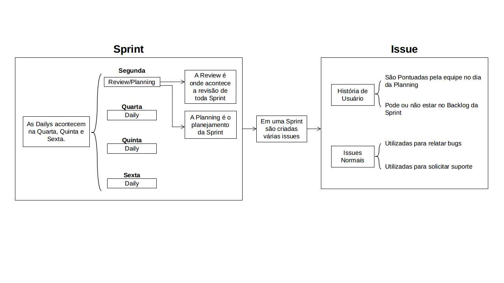

# Histórico de Versionamento
Data|Versão|Descrição|Autor
-|-|-|-
|11/09/2021 |1.0.0 |Criando estrutura do arquivo | @GeiseSaunier|
11/09/2021|1.0.1|Adição dos artefatos da metodologia aplicada | @GeiseSaunier e @IanoMaciel
11/09/2021|1.0.2|Adição das nossas modificações em cima do SCRUM | @GeiseSaunier e @IanoMaciel
11/09/2021 |1.0.3|Adição do diagrama metodológico do time | @GeiseSaunier e @IanoMaciel |
11/09/2021 |1.0.4|Atualização dos novos dias da Daily | @GeiseSaunier e @IanoMaciel |
11/09/2021 |1.0.5|Atualização dados da Daily, hora da reunião | @GeiseSaunier e @IanoMaciel |
11/09/2021 |1.0.6|Atualização dados do Diagrama Metodológico | @Geise e @IanoMaciel |
14/09/2021 |1.0.7| Desenvolvimento do diagrama metodológico| @IanoMaciel |
14/09/2021 |1.0.8|Adição do diagrama metodológico | @GeiseSaunier |

## 1. Justificativa 

No contexto atual da disciplina, a equipe está sendo apresentada a várias metodologias de desenvolvimento e gerenciamento, no entanto, como forma de estruturar um padrão para a melhor produtividade da equipe, optamos pela organização nos moldes do arcabouço SRCUM. 

## 2. Descrição da Metodologia

## Scrum

O Scrum é uma estrutura na qual as pessoas podem abordar problemas adaptativos complexos, entregando, de forma produtiva e criativa, produtos do mais alto valor possível.

O próprio Scrum é um framework simples para colaboração efetiva de equipes em produtos complexos. Os co-criadores do Scrum [Ken Schwaber]() e [Jeff Sutherland]() escreveram o [The Scrum Guide]() para explicar o Scrum de forma clara e sucinta. Este guia contém a definição de Scrum. Essa definição consiste nos papéis, eventos, artefatos e regras do Scrum que os unem.

## O Framework

Scrum é simples. É o oposto de uma grande coleção de componentes obrigatórios interligados. Scrum não é uma metodologia. Scrum implementa o método científico do empirismo. O Scrum substitui uma abordagem algorítmica programada por uma heurística, com respeito pelas pessoas e auto-organização, para lidar com a imprevisibilidade e resolver problemas complexos. O gráfico abaixo representa Scrum como descrito por [Ken Schwaber]() e [Jeff Sutherland]() em seu livro [Software in 30 Days], que nos leva desde o planejamento até a entrega do software.


## Valores
Esses valores incluem Coragem, Foco, Compromisso, Respeito e Abertura. Leia o [Guia do Scrum]() para saber mais sobre esses valores, como eles se aplicam ao Scrum.


## Papéis do Time

O Time Scrum consiste em um Dono do Produto (Product Owner ou PO), a Equipe de Desenvolvimento (Devs) e um Scrum Master (SM). As equipes do Scrum são auto-organizadas e interfuncionais. Equipes auto-organizadas escolhem a melhor forma de realizar seu trabalho, em vez de serem dirigidas por outras pessoas fora da equipe. Equipes multifuncionais têm todas as competências necessárias para realizar o trabalho sem depender de outros que não fazem parte da equipe. O modelo de equipe no Scrum foi desenvolvido para otimizar a flexibilidade, a criatividade e a produtividade.

## Eventos

Eventos são usados ​​no Scrum para criar regularidade e minimizar a necessidade de reuniões não definidas no Scrum. Todos os eventos são armazenados em **time-box**. Quando a Sprint começa, sua duração é fixa e não pode ser reduzida ou aumentada. Os eventos restantes podem terminar sempre que o objetivo do evento for alcançado, garantindo que uma quantidade apropriada de tempo seja gasta sem permitir desperdício no processo. Os Eventos Scrum são:

- Sprint
- Planejamento de sprint
- Daily
- Revisão de Sprint
- Retrospectiva da Sprint


## Artefatos

Os artefatos do Scrum representam **trabalho** ou **valor** para fornecer transparência e oportunidades de inspeção e adaptação. Os artefatos definidos pelo Scrum são projetados especificamente para maximizar a transparência das principais informações, para que todos tenham o mesmo entendimento do artefato.

Os artefatos do Scrum são:

- Backlog do produto
- Backlog do Sprint
- Incremento

## 3. Descrição da Metodologia

## Nossas Modificações

Durante a primeira semana de projeto fizemos uma reunião geral acerca da estrutura e dos horários que dedicaríamos ao desenvolvimento deste. Como somos apenas dois integrantes no time, as decisões foram, relativamente, simples. Dessa forma, definimos o planejamento de acordo com a divisão abaixo:

##### - Sprint (7 dias)

Percebemos que um bom período da sprint seria de 7 dias e que um tempo maior que isso acabaria trazendo falta de comunicação e erros no andamento do projeto. A nossa sprint tem início na segunda, às 18h e finaliza na segunda da próxima semana às 17h.

#### - Daily (Quarta-feira, quina-feira e sexta-feira)

Optamos pela Daily em três dias semanais apenas, pois achamos coerente quanto a comunicação e devido a disponibilidade da dupla. Todos os integrantes devem responder as seguintes perguntas:
- O que você fez desde a última sprint?
- O que pretende fazer até a próxima?
- Há algum obstáculo que esteja impedindo você ou a equipe de alcançar a meta do sprint?

Ressalta-se que a equipe realiza comunicação diária acerca do projeto, tanto no whatsApp quanto nas issues criadas para cada assunto.

#### - Planejamento na quinta-feira: de 12h às 13h:30min (horário sempre oscilante)

- Review
- Planning 

#### - ZenHub

Utilizaremos o ZenHub para melhor organização e acompanhamento das atividades desenvolvidas. Essa ferramenta nos permite criar um Roadmap interativo e ter uma visão ilustrativa do andamento do projeto.

#### - Velocity

Ainda utilizando o plugin do ZenHub vai ser útil para comparar o andamento do time durante as sprints

#### - Integração contínua e Deploy Contínuo

Para evitar possíveis erros na branch de produção e para melhorar o fluxo de entrega contínua vamos aplicar o conceito de **integração contínua** e **deploy contínuo** que será utilizado um fluxo de build, testes e deploy.

#### - Definição de Pronto

Vamos definir que alguma feature ou bug está concluído quando ele possuir 3 coisas
```
Código -> Teste -> Review
```
#### - Análise estática de código

Para analisar o nível do código sendo produzido vamos utilizar ferramentas de análise estática.

## Diagrama metodológico


